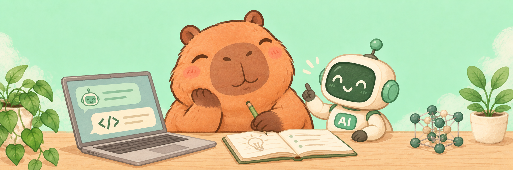

# Hi, I’m Bertil 👋

Exploring how AI and vibe coding can turn ideas from research and everyday life into practical tools.

探索用 AI 和 vibe coding，把研发与生活中的想法做成实用工具。

## What I’m exploring

- AI-assisted research workflows
- Practical tools inspired by everyday needs
- Rapid prototyping, learning, and experimentation

## Selected projects

### [Agent Bridge](https://github.com/jizw0704-source/agent-bridge)

Exploring collaboration between personal AI agents, with their owners’ permission.

探索让不同人的专属 AI Agent 在各自主人的授权范围内交流与协作。

`Personal project` · `MIT` · `Early-stage exploration`

Currently sharing product requirements and design documents; no runnable service yet.

### [IELTS Knowledge Reader](https://github.com/jizw0704-source/ielts-knowledge-reader)

A mobile-first reading tool for IELTS-style articles, vocabulary, and learning records.

读文章、积累词汇，记录自己的英语学习。

`Personal project` · `JavaScript`

### [拾音 AI Meeting Notes](https://github.com/jizw0704-source/shiyin-ai-meeting-notes)

A local-first Chinese AI meeting-notes project, explored and adapted from an open-source repository.

听见讨论，整理笔记；基于开源项目探索本地优先的中文 AI 听记。

`Forked project` · `AI exploration` · `JavaScript`

## A small note

I enjoy turning unclear ideas into working prototypes—sometimes for research, sometimes for everyday life.
